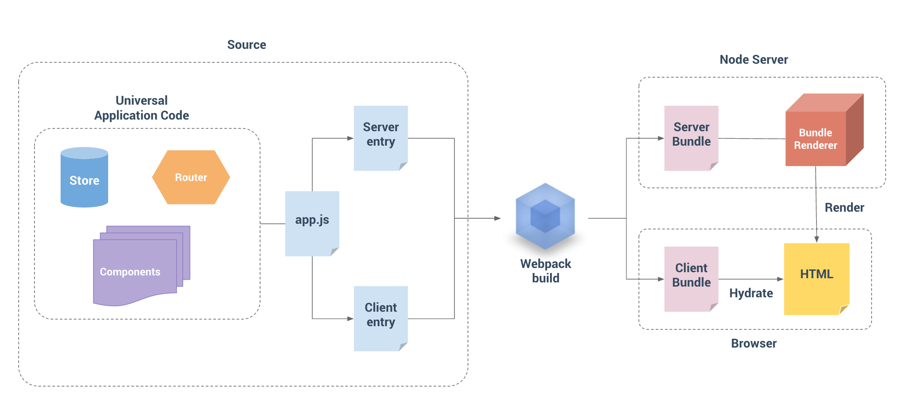

# Architecture Overview

Here's a nice diagram to illustrate (broadly) what is happening:



## Session flow

A user only actually performs a (HTML) document request once per session, at the very beginning. Let's call this "Session initialisation" (that's what I've called it in the logs).

From this initial request, the user is returned a document and React boots itself up, performing a checksum against the markup generated server-side. If the checksum is valid, it proceeds. If not, it rerenders. Avoid rerenders, as this in most cases literally negates the benefit of SSR.

From that point onward, the users experience within the application is entirely SPA. Route changes involve XHR requests (sometimes), and nothing else.

## Multiple applications in one repository

Abroadwith has two platforms:

1. Main platform
2. Educators platform

Historically, these existed as two repositories, `frontend` and `educators`. This doesn't make much sense though, as there is significant duplication across the two, and supporting, updating, and deploying two repositories is more difficult than one.

Going forward into the future, I plan to incorporate the 2.0 rebuild of the Educators platform into this repository. Ultimately the Main platform will serve on port 3000, and the Educators platform will serve on port 4000, both out of the same repository.

The fine details of how much actual source code will be shared, and the layout of the directories is TBD.

But, the general layout should probably look something like this:

```
.
├── ecosystem
|   ├── integration.json
|   └── production.json
|
├── educators-platform
|   └── ...entire application
|
├── main-platform
|   └── ...entire application
|
├── package.json
|
├── universal
|   └── ...shared components, utils, etc
```

The idea here is that while build config should live within the two individual apps, runtime config (`ecosystem`) should be at the top level so that management is as easy as possible.

Each application should have its own config dir with webpack configs and scripts so that we can do things like `npm run deploy:main-platform` and `npm run deploy:educators-platform` individually.

But, `package.json` and the `ecosystem` dir should live at the top level, so that we can perform all actions at that level, and start the entire ecosystem in one command: `npm run start-production:all` (or one by one: `npm run start-production:main-platform`).

Shared components and utils might be a bit tricky when it comes to path resolution. Might need a top-level `resolve.paths.js`.

Having a shared node_modules will greatly reduce the total dep size by reusing source code for both sets of bundles.

This part of the document is a WIP and I will add my ideas here as they come to me.
